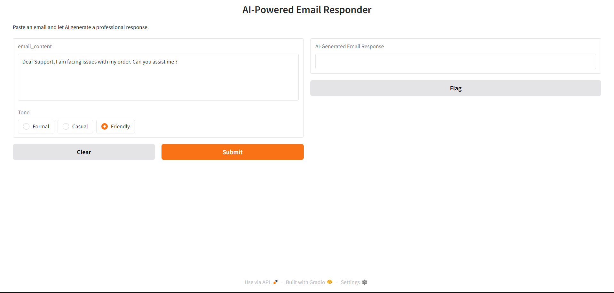

# 🤖 AI-Powered Email Responder

An AI-based tool that generates professional and context-aware replies to customer emails using LLaMA 3 via Ollama, FastAPI for backend, and Gradio for a simple web interface.

---

## 🚀 Features

- Generate polite and contextually accurate email responses.
- Choose tone of response: **Formal**, **Casual**, or **Friendly**.
- FastAPI-based backend with REST endpoint.
- Gradio-based frontend for quick interaction.
- Powered by **LLaMA 3** running locally via **Ollama**.

---

## 🛠️ Tech Stack

| Layer      | Tech Used                        |
|------------|----------------------------------|
| LLM Engine | Ollama + LLaMA 3 (local model)   |
| Backend    | FastAPI, Uvicorn, Pydantic       |
| Frontend   | Gradio                           |
| Language   | Python                           |
| API Comm   | REST via `requests` module       |

